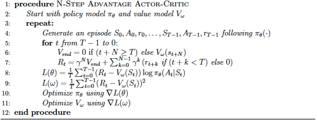
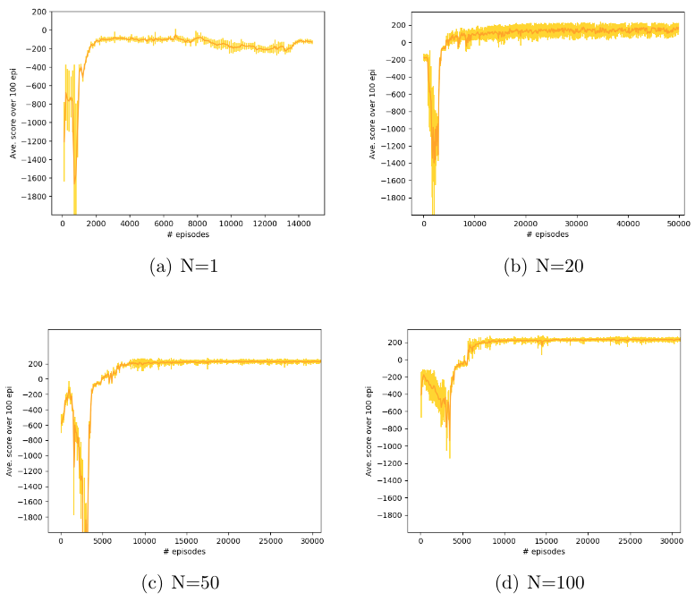
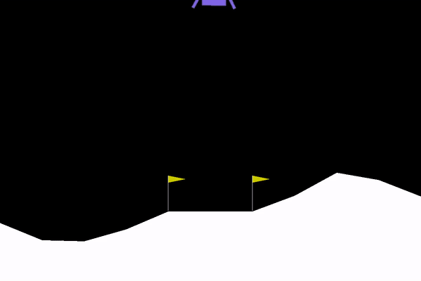

# N-Step Advantage Actor-Critic to Solve Lunar-Lander Environment

I implemented the N-step Advantage-Actor Critic algorithm to solve the LunarLander-v2 environment in OpenAI.



## N-Step Advantage Actor-Critic

run the code "a2c.py"

For 100 step, execute:

```python3 a2c.py --n=100```


## Some Descriptions

The algorithm has the following configuration: 

Actor NN architecture (encoded in LunarLander-v2-config.json), number of epoch = 5, Adam learning rate = 1e-4, the batch-size equals the size of the episode collected. Other implementation details: gamma = 0.99. I downscale the reward at each step by 100 to mitigate far-away initialization. I design the custom loss function, where for each data point in the training set, I compute the discounted G and create a vector with the zeros at the non-selected actions and G at the selected action. Then compute the mean of "-G log[tf.clip(\pi(A|S))]" as the loss function. Here I clip the policy network output into the range of [1e-15,1.0]. This clipping process is critical since it prevents the NaN ill-conditioning. Also, the lower clipping bound turns out to be sensitive in our algorithm and 1e-15 may lead to faster and more stable training.

Critic: NN architecture [input layer, hidden1 (16 units, relu, lecun-uniform initializer),hidden2 (16 units, relu, lecun-uniform initializer),hidden3 (16 units, relu, lecun-uniform initializer),hidden4 (16 units, relu, lecun-uniform initializer), output layer(1 unit, linear)], learning rate is 5e-4, number of eposh =5, the loss is mean-squared-error, learning batch equal the size of the episode collected.

I trained the a2c with N varying as [1, 20, 50, 100]. The plots are shown in figure 3 and the performance w.r.t. different N's are presented.

Compare to orther policy gradient algorithm like REINFORCE, A2C converges faster, there are several reasons: first, the A2C uses advantage value instead of full Monte-Carlo returns, which reduces the variance of the estimate and this contributes to the more stable convergence. In following figure, I can see that the std in REINFORCE in the first 5k episodes are much larger than A2C. I believe that this decrease in std stems from subtracting the Value function from the return. Second, N-step A2C limits the look-ahead to N steps forward without reaching the terminal of each episode in each learning iteration. Thus, the N-step target is applied. This is may to some extent improve the computing efficiency. Third, each time I update the actor using the policy gradient and at the same I evaluate the policy using critics, this will take advantage of both networks to control the variance and prevent the learning from going too far away.

Figure:



When changing the number of look-forward step N, I can observe that larger N improves the learning. For N=1, it seems converges fastest at about 2k episodes, but it gets stuck at around -100, and later the performance degrades. This is because the signal from the environment is too limited for the network to learn from in N=1. The N=20 can climb to 150+ to 200+, but during the convergence, I can still observe some perturbation. And the std is large (between +/- 50). N=50 to 100 appears much more stable after convergence. And the N=100 appears better in learning in the first 5k episodes without dropping to -2000. The reason is that with larger N, I will take more reward signal from environment into account to compute the advantage target, leading to a more accurate target, whereas for smaller N, I have to estimate based on another estimate, and more variance from the Q approximation will introduce.

In our implementation, the a2c algorithm is fast and efficient. This may due to 1) the reduction in variance of estimate of target values by using critic network and advantage function and 2) the application of N-step TD target for efficient computing while controlling the variance with different N.


## Videos for Post-Trained Performance

Post-Trained LunarLanders


